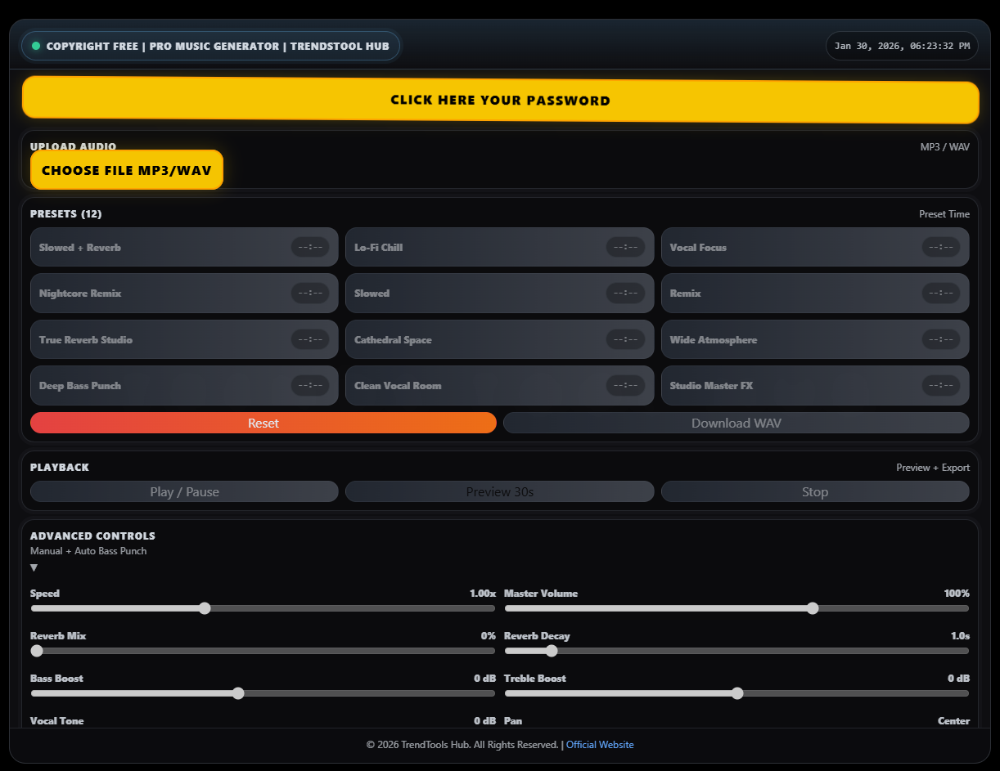
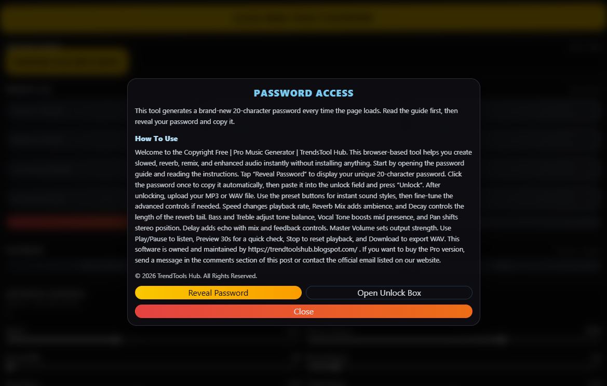
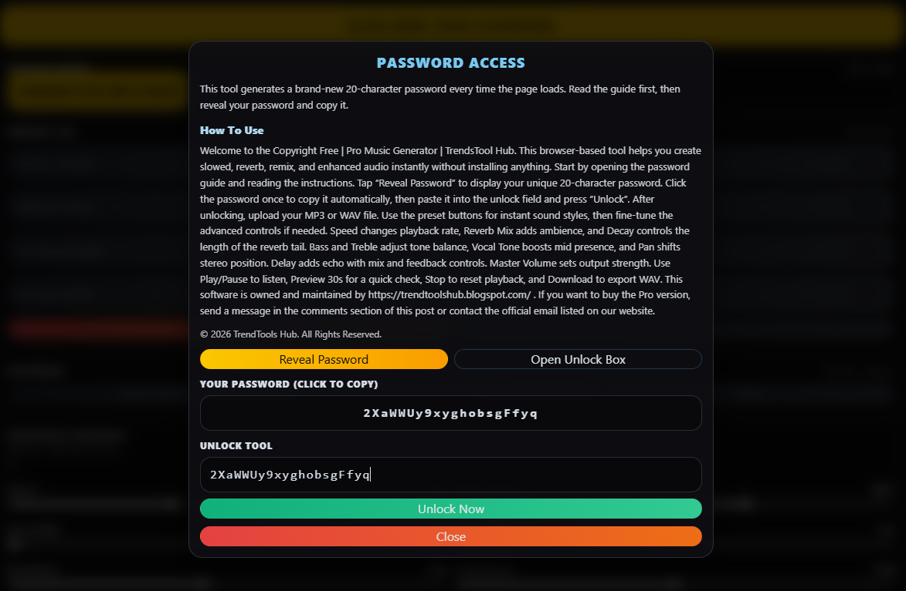
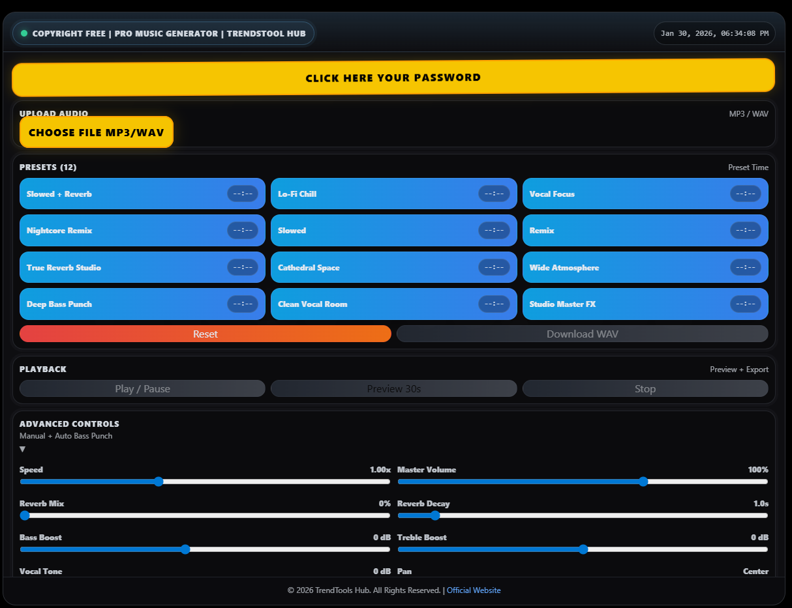

# 🎵 Pro Music Generator (Copyright-Free)

**Pro Music Generator** is a beginner-friendly, copyright-free music tool created for content creators who need safe background music for digital projects.

This project is part of **TrendTools Hub Studio**, a web-based platform focused on useful and practical tools for creators.

---

## 🔗 Live Project Demo
👉 https://youtu.be/9C-ooAxhU3g
👉 https://youtu.be/1Gul95PuyLs
👉 https://youtu.be/b0LzkE-aT-A
👉 https://youtu.be/0UPKxxdzEaM

---

## 📸 Pro Music Generator Screenshots

### 1️⃣ Main Interface

### 2️⃣ Upload & Presets

### 3️⃣ Playback Controls

### 4️⃣ Advanced Controls

### 5️⃣ Password Access System

*UI preview of the Copyright-Free Pro Music Generator tool*

---

## 🎶 Featured Tool: Copyright-Free Pro Music Generator

This tool helps creators generate **safe, non-copyright background music** for:

- YouTube videos  
- Blogs & articles  
- Reels & Shorts  
- Digital content creation  

---

## 📖 Full Project Details (Blog)

The complete explanation, concept, and usage guide are available on my blog:

👉 https://trendtoolshub.blogspot.com/2026/01/copyright-free-pro-music-generator-trendstool-hub_01056149124.html

---

## 🚀 Key Features

- 100% copyright-free music concept  
- Clean & simple user interface  
- Beginner-friendly project structure  
- Web-based (no installation required)  

---

## 🛠️ Technologies Used

- HTML  
- CSS  
- JavaScript  

---

## 👨‍💻 Who Can Use This Project?

- Beginner developers  
- Bloggers  
- Content creators  
- SEO learners  

---

## ✍️ Author

**Created by Falikol**

GitHub Profile 👉 https://github.com/falikol
